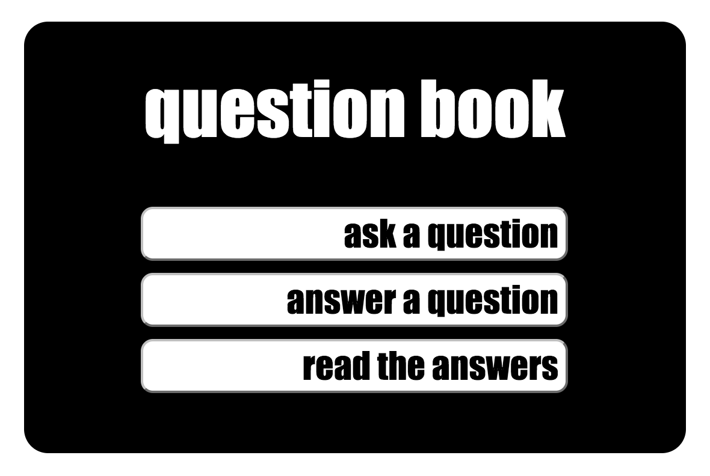
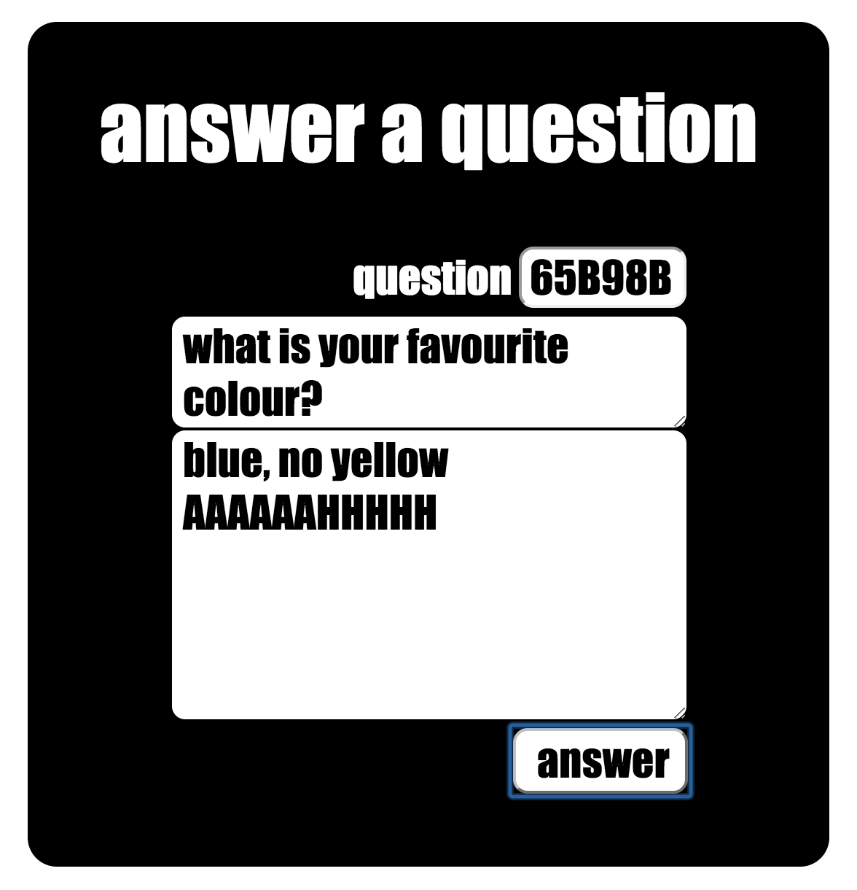

## question-book
A simple [ruby](https://www.ruby-lang.org/en/) app for creating,
asking, and answering questions.
Served by [sinatra](http://www.sinatrarb.com/).

Designed so you see everyone else's answers only *after* you answer
which helps to avoid initial bias [See Anchoring](http://en.wikipedia.org/wiki/Anchoring).

Not in finished. Work in progress...

